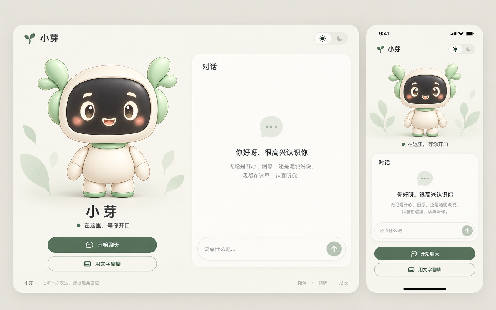
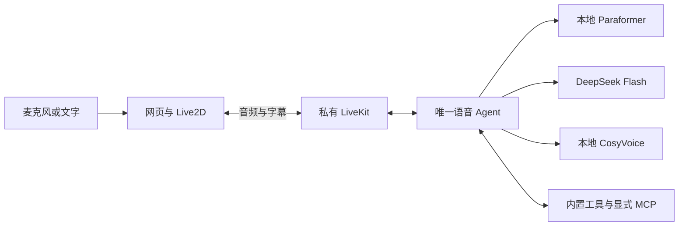

# 小芽 · Xiaoya

一个会听、会说、会用工具的中文数字人助手。浏览器中既能语音交流，也能直接打字；Live2D 神态、短手势和口型跟随助手实际播放的声音。

面向个人本机和私有环境：语音识别、合成与 LiveKit 自托管，对话使用 DeepSeek Flash。只维护一套灵动 Agent，不提供账号平台或公共语音服务回退。



_界面设计示意，不是实际运行或模型验收截图。当前效果与未完成项见 [分层验收记录](docs/delivery-acceptance.md)。_

## 能做什么

| 能力           | 使用体验                                                       |
| -------------- | -------------------------------------------------------------- |
| 语音与文字聊天 | 流式回复、实时字幕、语音打断；麦克风不可用时可选择文字入口     |
| 数字人互动     | 神态、手势与实际音频同步；动画失败或减少动态效果时保留静态形象 |
| 五个内置工具   | 查询时间、十进制计算、保存／查看／删除当前会话便签             |
| MCP 扩展       | 显式配置自己的外部工具；知识库和工单仅为独立示例，不默认加载   |
| 完整会话操作   | 连接可取消，故障可重试；结束／重连保留草稿与历史，不自动发送   |
| 自适应界面     | 桌面双栏、窄屏上下布局，浅色／深色／跟随系统主题               |

便签只保存在当前会话内存，不是跨会话记忆或定时提醒。工具结果以实际执行确认为准。

## 快速开始

### 1. 准备环境

| 项目     | 要求                                                                                           |
| -------- | ---------------------------------------------------------------------------------------------- |
| 本机开发 | Windows 11、PowerShell 7、Python 3.12、uv                                                      |
| 网页     | Node.js 24、pnpm 9.15.9                                                                        |
| 语音服务 | 可访问的私有 LiveKit、Paraformer 与 CosyVoice；随附 GPU 部署使用 WSL Ubuntu 22.04／NVIDIA CUDA |
| 对话服务 | DeepSeek 官方 `deepseek-flash` 和独立 API Key                                                  |
| 启动工具 | 官方独立 LiveKit CLI `lk`，或将官方二进制放入被忽略的 `.tools/lk.exe`                          |

仓库不包含语音模型权重，也不会凭空创建上述服务。首次准备 WSL 后端请先阅读 [部署说明](deployment/README.md)；已有服务则直接填写其地址。

```powershell
git clone https://github.com/kongweiguang/xiaoya.git
Set-Location xiaoya
uv sync --locked
pnpm --dir web install --frozen-lockfile
if (-not (Test-Path .env.local)) { Copy-Item .env.example .env.local }
if (-not (Test-Path web/.env.local)) { Copy-Item web/.env.example web/.env.local }
```

配置复制仅在文件不存在时执行，不覆盖已有密钥。尚未安装官方 CLI 时可执行 `winget install LiveKit.LiveKitCLI`；`.tools/` 不随源码提交。

### 2. 填写配置

根 [`.env.example`](.env.example) 与网页 [`web/.env.example`](web/.env.example) 分别复制为同目录的 `.env.local`，再填写实际配置。

| 服务    | 配置约束                                                                           |
| ------- | ---------------------------------------------------------------------------------- |
| LiveKit | 私有 URL、API Key、API Secret；网页与 Agent 使用同一实例和 `xiaoya` 名称           |
| STT     | 显式地址、`paraformer-streaming` 与独立密钥；主 Agent 固定 WebSocket 协议          |
| LLM     | `https://api.deepseek.com`、`deepseek-flash` 与独立真实密钥；语音模式关闭 thinking |
| TTS     | 显式地址、`cosyvoice3-0.5b`、`default` 音色与独立密钥；支持 PCM／WAV               |

无鉴权的私有 STT／TTS 必须填写 `not-required`，不能留空。客户端不继承 `OPENAI_API_KEY`，不回退公共语音服务。房间模式启动前检查完整 LiveKit 凭据；console 不要求它们。

网页 Secret 只由服务端读取，不能放入浏览器公开环境变量。默认令牌入口仅允许本机同源请求；远程访问必须经过已认证网关，普通端口转发不等于鉴权。

### 3. 选择使用方式

先准备本地检测模型：

```powershell
uv run xiaoya download-files
```

**终端语音**：私有 STT／TTS 和 DeepSeek 已就绪后，在项目根目录运行：

```powershell
uv run xiaoya console
```

console 使用本机麦克风和扬声器，`Ctrl+C` 退出；`uv run xiaoya console --list-devices` 查看设备。

**网页聊天**：已按部署说明安装 WSL 后端时，在项目根目录的两个终端分别运行：

```powershell
pwsh -File deployment/start-wsl.ps1
pwsh -File deployment/start-web.ps1
```

打开 `http://127.0.0.1:3000`，选择“开始聊天”或“用文字聊聊”。文字入口不需要麦克风权限；语音入口需允许浏览器采集。只有用户发起会话后才创建连接和媒体资源。

需要热重载开发时，可分别运行 `uv run xiaoya dev` 与 `pnpm --dir web dev`。不要与 WSL 常驻 Agent 同时启动第二份 Agent；网页手动启动前须核对私有服务地址。

## 运行链路与数据边界



麦克风音频在私有 LiveKit 和本地 speech 中处理；识别文本、对话历史及工具上下文会发送到 DeepSeek，因此不是完全离线应用。

- 会话唯一持有 SDK 客户端与表现快照；启动中途失败逐项回收，不发送开场白。正常关闭由 Job 生命周期触发。
- PCM／WAV 共用可取消链路，在线程外等待模型许可；首块前服务失败返回 503，首块后失败终止流，不重播已输出内容。
- 表现通道校验 SID、修订号与播放许可；内部控制头仅为 `[xiaoya:<style>|<gesture>]`，普通括号正文保留。
- Windows 启动器只管理本项目三个 systemd 单元的启动／就绪／日志，不另起前台 Agent，也不自动调用付费 LLM。
- HTTP 转写是独立诊断接口，不承担主 Agent 的自动回退；诊断和真实房间脚本需手动运行。

## 开发与验证

在项目根目录执行：

```powershell
uv run ruff check .
uv run ruff format --check .
uv run pytest
uv run xiaoya --help
pnpm --dir web test
pnpm --dir web lint
pnpm --dir web typecheck
pnpm --dir web format:check
```

前端开发、测试、类型检查和构建入口会先从保留的官方 TypeScript 源码生成 SDK，无需维护生成的 JS／类型声明。默认测试不连接外部模型或真实房间。

开发服务运行期间，用独立目录做生产构建，避免覆盖它的缓存：

```powershell
$previousBuildDirectory = $env:NEXT_DIST_DIR
$env:NEXT_DIST_DIR = '.next-build'
try { pnpm --dir web build }
finally {
    if ($null -eq $previousBuildDirectory) { Remove-Item Env:NEXT_DIST_DIR -ErrorAction SilentlyContinue }
    else { $env:NEXT_DIST_DIR = $previousBuildDirectory }
}
```

当前模型统一检查入口：

```powershell
node assets/avatar/xiaoya/tooling/validate-model.mjs --output .tools/logs/model-check.json
```

旧 Java／Umamo 制作和单项检查器仅为历史材料；新模型验收前保留，不作为当前制作或交付入口。

## 文档与当前状态

| 文档                                       | 内容                                                   |
| ------------------------------------------ | ------------------------------------------------------ |
| [部署说明](deployment/README.md)           | 私有服务准备、systemd 管理、同步与显式诊断             |
| [网页客户端](web/README.md)                | 本机启动、令牌边界、缓存与目录职责                     |
| [工具与 MCP](docs/tools.md)                | 五个内置工具、外部配置与独立示例                       |
| [灵动交互](docs/delivery.md)               | 语气、神态、手势和同步协议                             |
| [模型资产](assets/avatar/xiaoya/README.md) | 原画、现行检查入口与稳定版重建要求                     |
| [SDK 来源与许可](docs/live2d/sdk.md)       | 固定发行包、补丁、Core 指纹与第三方许可                |
| [分层验收](docs/delivery-acceptance.md)    | 离线、私有接口、完整房间、模型工程和真人设备的独立结果 |
| [开发约束](AGENTS.md)                      | 轻量 DDD、依赖方向、函数注释与运行边界                 |

代码检查与自动房间链路已经过验收；新稳定版模型的 19 普通参数／0 BlendShape、组合绑定与官方工程往返，以及真人麦克风／扬声器、回声和自然度仍未完成。当前运行包保留，候选未通过前不混用或替换；不能把离线测试、合成音频或设计示意图当成这些验收通过。

## 提交与许可

原创代码与资源采用 [MIT 许可证](LICENSE)。网页保留原 [LiveKit 模板许可](web/LICENSE)；Cubism 与 MotionSync 按随附的第三方许可证分发，不由 MIT 覆盖。企业 SDK 发行许可须按其条款另行确认。

源码、测试、锁文件、示例配置、现行运行资产及 SDK 源码／Core／许可证纳入 Git。`.env.local`、`mcp.local.json`、私有凭据、生成 SDK、缓存、日志、原始验收数据和失败候选留在本机并由忽略规则排除。
