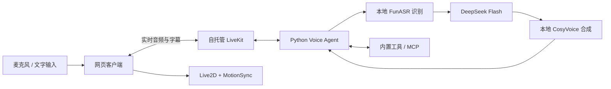

# 小芽 · Xiaoya

一个能听、能说、能用工具的中文数字人助手。以 LiveKit 连接语音会话，在浏览器中用 Live2D 呈现小芽，支持语音与文字聊天。

**本地语音识别与合成 · DeepSeek 流式对话 · Live2D 口型同步 · MCP 工具**


*界面设计示意，图片来自 docs；实际角色由随项目交付的 Live2D 模型绘制。*

## 能做什么

| 能力 | 说明 |
| --- | --- |
| 语音与文字聊天 | 中文对话、流式回复、实时字幕、语音打断；也可直接输入文字 |
| 数字人互动 | 待机、倾听、思考和说话状态；口型分析助手实际播放的音频 |
| 日常工具 | 查询时间、准确计算、保存／查看／删除本次会话的便签 |
| MCP 扩展 | 随附演示知识库与模拟工单，支持 stdio、Streamable HTTP 和 SSE 服务 |
| 完整会话操作 | 连接中取消、失败重试、麦克风切换、结束聊天、发送失败保留草稿 |
| 自适应界面 | 桌面与手机布局、浅色／深色主题、减少动态效果与静态后备形象 |

便签仅在当前会话内存中保存，不提供跨会话记忆。知识库和工单工具使用演示数据，接入实际业务需配置自己的 MCP 服务。

灵动交互可通过 `VOICE_AGENT_EXPRESSIVE_ENABLED=true` 试用，协调句段的语气、神态与短手势。默认关闭；增强模型仍处于候选阶段，交付边界见 [灵动交互说明](docs/delivery.md)。

## 如何工作



- **语音会话**：Python 3.12、uv、LiveKit Agents；轮次结束使用本地 Silero VAD 与固定的 `v1-mini` 模型，打断检测使用本地 VAD。
- **本地语音服务**：FunASR Paraformer 在线识别；CosyVoice3 0.5B 流式合成，当前部署使用 CUDA，可选 vLLM 加速。服务有独立的依赖与锁文件。
- **对话模型**：显式连接 `https://api.deepseek.com` 的 `deepseek-flash`，使用 Chat Completions SSE，语音模式关闭深度思考。
- **网页与角色**：Next.js、React、LiveKit、Cubism Web SDK 和 MotionSync。房间传输音频，人物由浏览器本地绘制。

原始麦克风音频由私有 LiveKit 和本地语音服务处理；识别文本、对话历史及工具上下文会发送到 DeepSeek。各服务的地址、模型和密钥独立配置，配置缺失时启动失败，不自动回退公共服务。

## 快速开始

以下命令使用 Windows 11 与 PowerShell 7。先准备可访问的私有 LiveKit、STT、TTS 服务，以及 DeepSeek API Key；本项目不会随仓库分发语音模型权重。

### 1. 准备环境

| 工具 | 要求 |
| --- | --- |
| Python | 3.12，由 `.python-version` 指定，使用 uv 管理 |
| Node.js | 24.x |
| pnpm | 9.15.9，版本记录在 `web/package.json` |
| LiveKit CLI | 官方独立 `lk`，供 `console/dev/start` 启动使用 |
| 本地语音运行环境 | 随附部署方案使用 WSL Ubuntu 22.04 与 NVIDIA CUDA，详见部署文档 |

安装 LiveKit CLI：

```powershell
winget install LiveKit.LiveKitCLI
```

也可将官方 Windows 二进制放到 `.tools/lk.exe`。`.tools/` 为本地工具目录，不进入版本管理。

```powershell
git clone https://github.com/kongweiguang/xiaoya.git
Set-Location xiaoya
uv sync --locked
pnpm --dir web install --frozen-lockfile

if (-not (Test-Path .env.local)) { Copy-Item .env.example .env.local }
if (-not (Test-Path web/.env.local)) { Copy-Item web/.env.example web/.env.local }
```

### 2. 填写配置

编辑根目录 `.env.local`，填写你的服务地址、模型名、音色和鉴权参数：

```dotenv
# 私有 LiveKit；console 模式不需要这三项。
LIVEKIT_URL=ws://127.0.0.1:7880
LIVEKIT_API_KEY=your-private-key
LIVEKIT_API_SECRET=your-private-secret
VOICE_AGENT_AGENT_NAME=xiaoya

# 本地识别服务；兼容 HTTP 服务可把 PROTOCOL 改为 http。
VOICE_AGENT_STT_BASE_URL=http://127.0.0.1:8001/v1
VOICE_AGENT_STT_MODEL=paraformer-streaming
VOICE_AGENT_STT_PROTOCOL=websocket
VOICE_AGENT_STT_API_KEY=

# DeepSeek，必须填写独立真实密钥。
VOICE_AGENT_LLM_BASE_URL=https://api.deepseek.com
VOICE_AGENT_LLM_MODEL=deepseek-flash
VOICE_AGENT_LLM_API_KEY=your-deepseek-api-key

# 本地合成服务；PCM 固定为 24 kHz、16 位、小端、单声道。
VOICE_AGENT_TTS_BASE_URL=http://127.0.0.1:8001/v1
VOICE_AGENT_TTS_MODEL=cosyvoice3-0.5b
VOICE_AGENT_TTS_VOICE=default
VOICE_AGENT_TTS_RESPONSE_FORMAT=pcm
VOICE_AGENT_TTS_API_KEY=
```

完整选项见 [.env.example](.env.example)。无鉴权的私有 STT/TTS 可留空密钥，客户端使用 `not-required` 占位值；所有模型客户端均不继承 `OPENAI_API_KEY`。系统环境变量优先于 `.env.local`。

网页使用独立的 `web/.env.local`，填写同一个私有 LiveKit 的 `LIVEKIT_URL`、`LIVEKIT_API_KEY`、`LIVEKIT_API_SECRET` 和 `AGENT_NAME=xiaoya`。LiveKit Secret 只由服务端令牌接口读取，不发送到浏览器。

> 示例地址和凭据用于说明配置格式。请填写自己的实际服务配置；WSL 地址可能随重启变化。真实密钥只放在本机环境变量或被忽略的 `.env.local` 中。

### 3. 准备模型并启动

下载 Agent 的本地检测模型：

```powershell
uv run xiaoya download-files
```

**终端语音体验**：私有 STT/TTS 已运行、DeepSeek 可访问时执行：

```powershell
uv run xiaoya console
```

该模式使用本机麦克风和扬声器，不要求 LiveKit 凭据。建议使用耳机，`Ctrl+C` 退出；`uv run xiaoya console --list-devices` 查看设备。

**网页体验**：先启动配置对应的私有 LiveKit 与语音服务，再分别打开两个终端。

```powershell
# 终端一：在项目根目录启动 Agent。
uv run xiaoya dev
```

```powershell
# 终端二：启动网页。
Set-Location web
pnpm dev
```

访问 **http://localhost:3000**，选择“开始聊天”或“用文字聊聊”。网页通过本项目的 `/api/token` 接口签发房间令牌，并显式派发名为 `xiaoya` 的 Agent。

已有 `/opt/xiaoya` WSL 运行环境时，也可使用 `deployment/start-wsl.ps1` 和 `deployment/start-web.ps1`。首次部署需另行准备服务二进制、LiveKit 配置和语音权重，操作见 [部署说明](deployment/README.md)。Windows 与 WSL 各自使用独立虚拟环境；同时只启动一份 Agent。

生产 Agent 使用 `uv run xiaoya start`；没有独立 `lk` 的服务器可通过 SDK runner 启动：

```powershell
uv run -m livekit.agents start src/xiaoya/interfaces/cli.py
```

当前网页令牌接口用于本地开发，生产模式会拒绝未接入鉴权的请求。对外部署需完成用户鉴权、HTTPS 和媒体网络配置。

## 模型接口与扩展

| 服务 | 接口契约 |
| --- | --- |
| STT · HTTP | `POST /audio/transcriptions`，multipart 音频输入，返回包含 `text` 的 JSON |
| STT · WebSocket | 本项目 `/audio/transcriptions/stream` 协议，增量 PCM16、`partial` 与 `commit/final` |
| LLM | `POST /chat/completions`，SSE 流式文字与 function calling |
| TTS | `POST /audio/speech`，返回音频；本地服务支持流式 PCM |

`BASE_URL` 填服务 API 前缀，客户端追加接口路径。LLM 使用 `openai` 插件连接兼容协议，模型供应商与协议适配均位于基础设施层。工具调用要求模型支持 `tools`、分片 `delta.tool_calls` 和 `role=tool` 结果回传。

可以直接尝试：“现在北京时间几点？”、“帮我算 128 乘 3，加 56，再除以 4。”、“记一条便签，内容是带耳机。”。外部 MCP 配置请复制 `mcp.example.json` 为 `mcp.local.json`，设置 `VOICE_AGENT_MCP_CONFIG_FILE`，详见 [工具与 MCP 使用说明](docs/tools.md)。

## 项目结构

```text
src/xiaoya/
  domain/          领域规则与值对象
  application/     业务用例与端口
  infrastructure/  LiveKit、模型与 MCP 适配器
  interfaces/      CLI 与 Job 入口
  bootstrap.py     依赖装配
services/speech/   本地语音推理服务，独立 uv 环境
web/               网页客户端、Live2D 运行资源与 SDK
assets/avatar/     角色原画、分层 PSD、可编辑 CMO3 与制作工具
docs/              功能说明、设计图与验收文档
deployment/        WSL 服务配置、启动与验证脚本
tests/             Python 离线测试
```

遵循轻量 DDD：领域与应用层不依赖 LiveKit、网络和环境变量；每个 Job 独立创建会话，由 Job 生命周期释放资源。详细约束见 [AGENTS.md](AGENTS.md)。

## 开发检查

在根目录执行：

```powershell
uv sync --locked
uv run ruff check .
uv run ruff format --check .
uv run pytest
uv run xiaoya --help
```

在 `web/` 执行：

```powershell
pnpm install --frozen-lockfile
pnpm sdk:build
pnpm test
pnpm lint
pnpm format:check
pnpm exec tsc --noEmit --incremental false
$env:NEXT_DIST_DIR = '.next-build'
pnpm build
Remove-Item Env:NEXT_DIST_DIR
```

默认 Python 测试使用离线模拟，不连接外部模型和真实房间。真实接口、完整语音链路、浏览器合成音频与真人设备验收分别记录；自动测试通过不代表用户真实麦克风和扬声器已经验收。

## 文档

| 文档 | 内容 |
| --- | --- |
| [部署说明](deployment/README.md) | WSL 环境、语音模型、服务管理与历史运行记录 |
| [Live2D 使用与维护](docs/live2d/README.md) | 会话操作、口型同步、故障恢复与资源生命周期 |
| [工具与 MCP](docs/tools.md) | 演示话术、外部服务配置及验证方法 |
| [灵动交互](docs/delivery.md) | 语气、神态和手势的协同规则与试用边界 |
| [角色制作](assets/avatar/xiaoya/README.md) | 原画、PSD、CMO3、模型重建与正式资源 |
| [SDK 来源与许可](docs/live2d/sdk.md) | 固定版本、文件指纹、随附许可与使用约束 |
| [Live2D 验收记录](docs/live2d/acceptance.md) | 历史验证结果及未覆盖范围 |

## 提交内容与许可

本项目原创代码与资源采用 [MIT 许可证](LICENSE)，版权归属 `kongweiguang`。第三方代码、SDK 与资源继续遵循各自随附的许可证。

仓库保留源码、测试、依赖锁文件、示例配置、正式角色源文件与运行资源，以及 SDK 的版权和许可文本。

`.env.local`（包括 `web/.env.local`）、`mcp.local.json`、私有凭据、虚拟环境、`node_modules`、Next.js 构建缓存、日志与 `.tools/` 均由 `.gitignore` 排除。`deployment/evidence/` 的原始验收录像、音频、截图和历史备份留在本地，文档中指向这些文件的链接需在原工作区查看。

网页基于 [LiveKit Agent Starter for React](https://github.com/livekit-examples/agent-starter-react) 适配，保留其 [MIT 许可证](web/LICENSE)。Live2D SDK 和 MotionSync 使用随附的各自许可，见 [SDK 记录](docs/live2d/sdk.md)；这些许可不由前端模板的 MIT 许可证覆盖。
